# Env-Sensor
Environmental Sensor Telemetry Data Platform

# Introduction & Goals
- This is my data platform project, using traditional tools.
- The goal is to get to know some of the tools of the field of data engineering and practice it.
# Contents

- [The Data Set](#the-data-set)
- [Used Tools](#used-tools)
  - [Connect](#connect)
  - [Buffer](#buffer)
  - [Processing](#processing)
  - [Storage](#storage)
  - [Visualization](#visualization)
- [Platform Design](#platform-design)
- [Pipelines](#pipelines)
  - [Stream Processing](#stream-processing)
    - [Storing Data Stream](#storing-data-stream)
    - [ETL Process](#etl-process)
  - [Batch Processing](#batch-processing)
  - [Visualizations](#visualizations)
- [Prerequisites](#prerequisites)
- [Setup and run](#setup-and-run)
- [Stop](#stop)
- [Conclusion](#conclusion)
- [Follow Me On](#follow-me-on)
- [Appendix](#appendix)


# The Data Set
- About this data set
  - [Environmental sensor telemetry data](https://www.kaggle.com/garystafford/environmental-sensor-data-132k)
- What is a problems of this data set?
  - Some information cannot be directly graph.
  - Some device have outliers value.
- What do i want to do with it?
  - Data ingestion and storage, Delivery this data to database.
  - Convert data to be available.
  - Visualize the data by comparison over time.
  - Rest api of data stats.

# Used Tools
- [Apache Kafka](https://kafka.apache.org/documentation/)
  - Use to buffer data stream line. before storage.
- [PostgresSQL](https://www.postgresql.org/docs/13/intro-whatis.html)
  - Data set storage database(staging area)
- [pgAdmin 4](https://www.pgadmin.org/docs/pgadmin4/5.3/index.html)
  - Monitoring and managing postgres.
- [Apache Airflow](https://airflow.apache.org/docs/)
  - ETL process scheduler.
- [Grafana](https://grafana.com/grafana/)
  - Visualization the data.
- [Flask](https://flask.palletsprojects.com/en/2.0.x/)
  - For Rest Api.
- [Docker](https://www.docker.com/resources/what-container)
  - Setup all environment services.

## Connect
- Ingestion data from local by using pyhton script, and simulate theme to kafka.
## Buffer
- In the buffer phase i have kafka for produce a device data, from simulation and consume to postgres.
## Processing
- Convert data to right format.
- Filter data for outliers.
- Data Stats
- Combine data for analysis.
## Storage
- Store data in postgresSQL for structure database.
- Managing and monitoring theme by pgAdmin4.
## Visualization
- Comparison by devices data over time, by Grafana

# Platform design
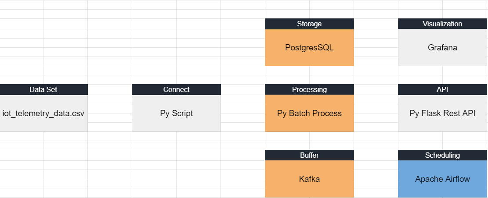

# Pipelines
## Stream Processing
### Storing Data Stream
- This pipeline imports data from local using python script and simulates it as kafka and then inserts data into postgres db.

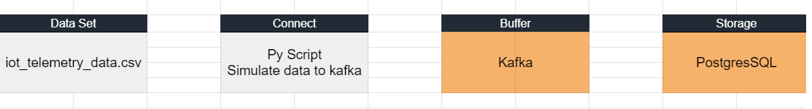
### ETL Process
- This pipeline is an elt process where the airflow scheduler takes data from postgres, then combines and converts it to a format suitable for visualization.

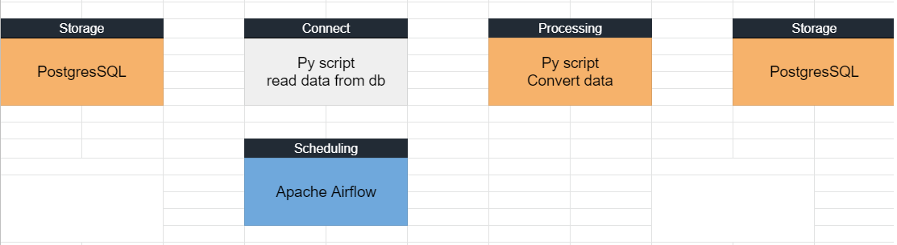
## Batch Processing
- This pipeline processes data statistics and graphs by Rest api requests.

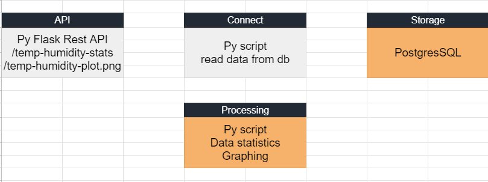
## Visualizations
- Display a comprehension over time of each attribute.

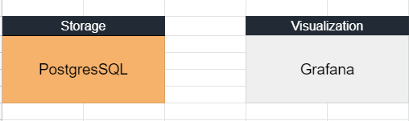

# Prerequisites
You will need to install.
- [Docker](https://docs.docker.com/get-docker/)
- [Docker Compose](https://docs.docker.com/compose/install/)
- [Docker Desktop](https://www.docker.com/products/docker-desktop)(Optional)
- [Git](https://git-scm.com/downloads)

# Setup and run
## Environment Services
First thing first, install requirements packages.
Run the below commands in the project directory.

```bash
pip install -r requirements.txt
```

Start the services, Everything is dockerized.
Run the below commands in the project directory.

```bash
docker-compose up -d # -d mean run in detached mode (in the background)
docker ps # display all running containers you also do it with docker desktop
```

## pgAdmin4
- http://localhost:8090/ Username: user@domain.com Password: 123456
- Add new server
- Server name: env_server (or what ever you want.)
- Host name/address: Place postgres-env-sensor ip
```bash
docker inspect -f '{{range.NetworkSettings.Networks}}{{.IPAddress}}{{end}}' postgres-env-sensor # get only ip
docker inspect postgres-env-sensor bridge # you also inspect bridge network of the image
```
- Username: postgres Password: 123456
- Save

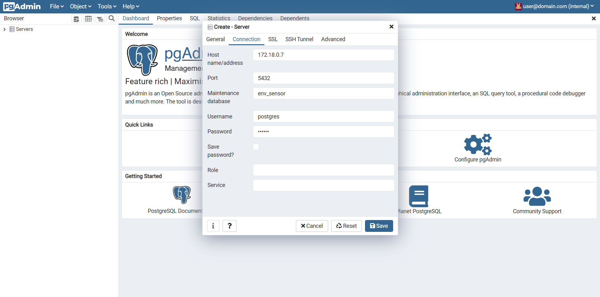

- Here you can monitoring and managing postgres database.

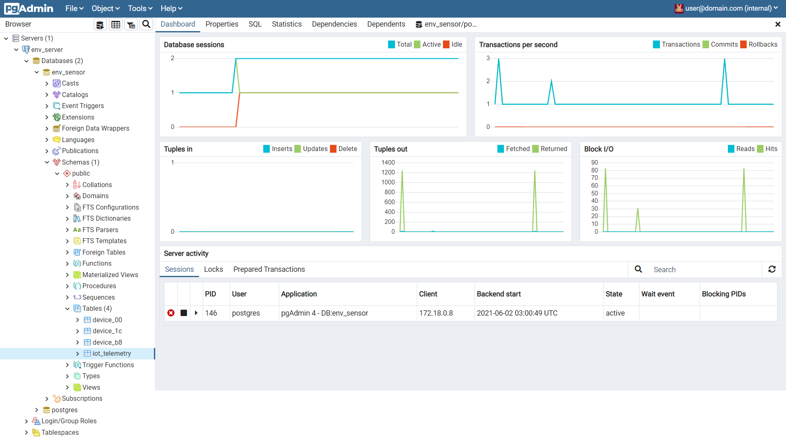

## Grafana
- http://localhost:3000/ Username: admin Password: admin
- Set up your new grafana password
- Use postgres-env-sensor ip, for setup a new data source connection.
```bash
docker inspect -f '{{range.NetworkSettings.Networks}}{{.IPAddress}}{{end}}' postgres-env-sensor # get only ip
```

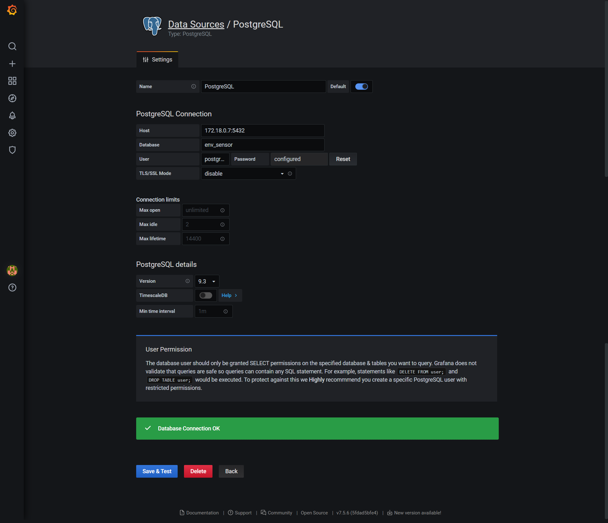

- Import env_dashboard.json for dashboard.
- You can find env_dashboard.json in project root directory

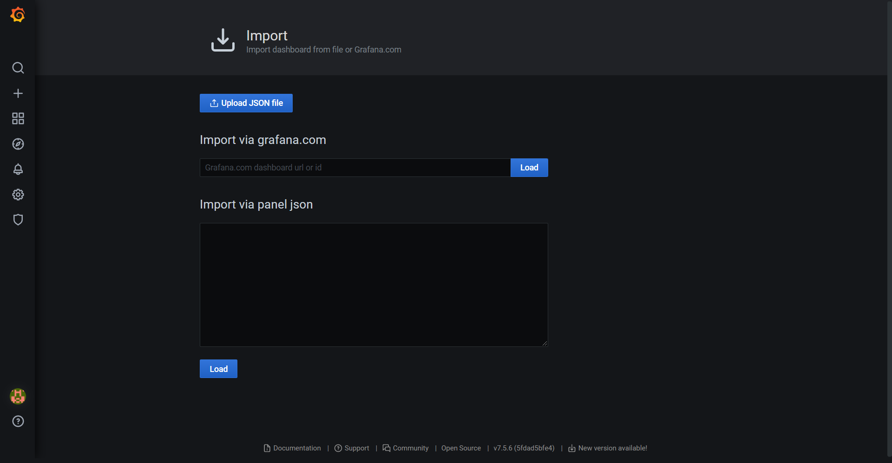

## Kafka
### Check the kafka topics. 
```bash
docker exec -t kafka \
kafka-topics.sh \
  --bootstrap-server :9092 \
  --list # in windows cmd, terminal change \ to `
```
- If you see this topic, that mean kafka ready for produce and consume.
```bash
device_00
device_1c
device_b8
```

### Start stream line data
- Start kafka consumer 
```bash
python consumer.py
```
- Start kafka producer (open new terminal)
```bash
python producer.py
```

  then you can see data in consumer terminal running to database, and you can check in pgAdmin4 service.

## Airflow
  - http://localhost:8080/ Username: airflow Password: airflow
  - In airflow dashboard, etl_process dag should be there.
  - Open [etl_process_cons.py](dags/etl_process_cons.py) 
    - Change IP address of POSTGRES_ENDPOINT = 'postgres:123456@xxx.xxx.xxx.xxx:5432/env_sensor' to.
  ```bash
  docker inspect -f '{{range.NetworkSettings.Networks}}{{.IPAddress}}{{end}}' postgres-env-sensor # get only ip
  ```
  - Open [etl_process_dag.py](dags/etl_process_dag.py) 
    - Change 'start_date' and 'end_date' in default_args to your timezone and datetime, when you want to start this task.

  - Go to airflow service http://localhost:8080/
  unpause DAG: etl_process and wait.

  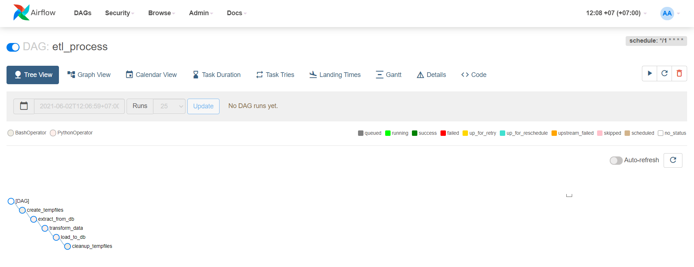

  - When the dag started you can see each task status.
  - Green is mean success, then you can check new data in pgAdmin4 or grafana dashboard.

  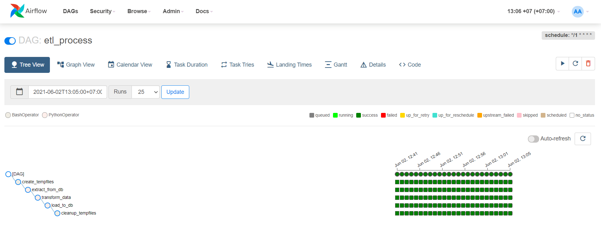

## Grafana
  - Go back to grafana dashboard and click the refresh button, you will see the data visualize.

  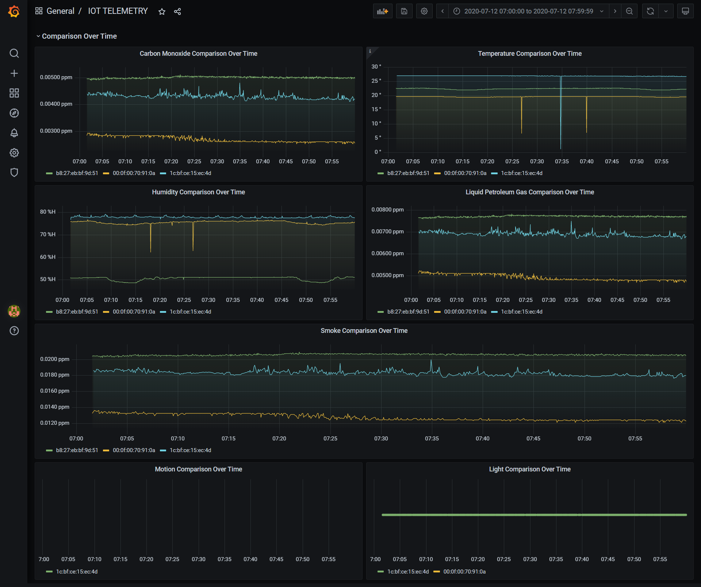

## Rest API
### Strat rest api server
  - New terminal and run app.py
  ```bash
    python app.py
  ```
  - You can use two simple in this project or create more rest api in app.py
  - You also use postman for make a request and see the response from api.
  - It covers a period of time, by starting from the time of kafka start to produce until user request this api.
  - http://127.0.0.1:5000/temp-humidity-stats
    - This service transmits simple statistical temperature and humidity information.

  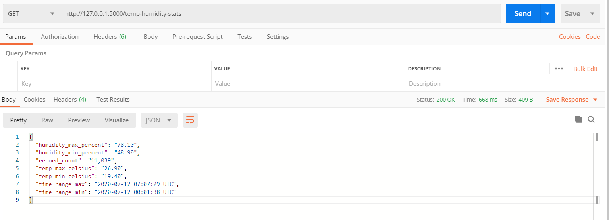

  - http://127.0.0.1:5000/temp-humidity-plot.png
    - This service create a graph to display the relation of temperature and humidity.

  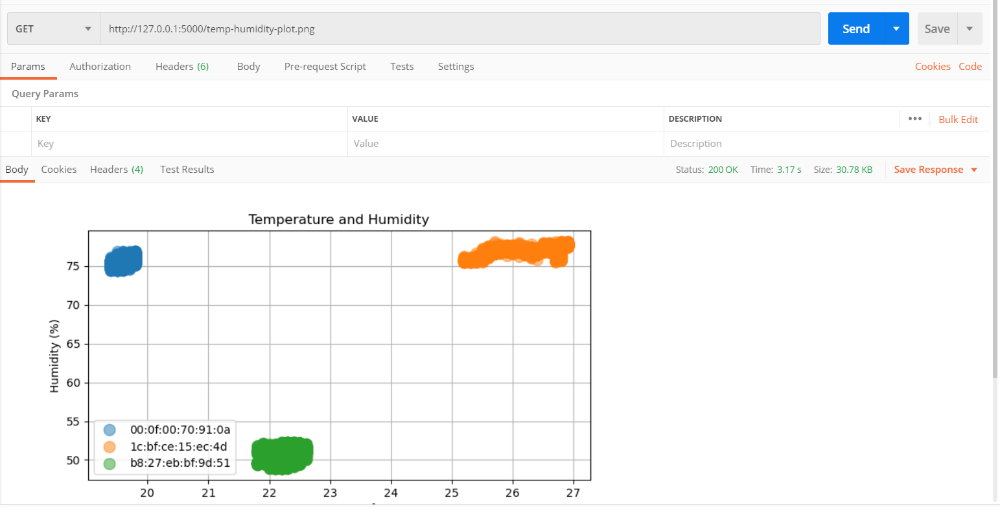

# Stop
### Ctrl+C for terminate running terminal.
- consumer terminal
- producer terminal
- app(rest api) terminal
### Stop and remove volumns at all docker containers.
```bash
  docker-compose down
  docker-compose down -v # if you need to remove volumns of all containers
```
#### Note: For kafka log retention memory, I have setting for one hour then kafka will remove it, If you don't want that, You can setup in docker compose file at KAFKA_LOG_RETENTION_MS args.

# Conclusion
### This is major things i have learned.
- This project leads me to learning about data platform and pipeline design.
- I have learned a lot of tools for build the data pipeline.
  - I know more about docker container.
  - Create scheduling and monitoring task by airflow.
  - Ingestion data, data simulation, convert data, process data, etc.. by python 3.
  - Create buffering by kafka.
    - create a topics
    - think about partition and replica
    - make a producer to delivery data
    - make a consumer to receive data
  - Store data in postgres by python3 or kafka connect(i don't use it to this project)
  - Use pgAdmin4 for monitoring and managing postgres db.  
  - Use Grafana to create simple visualization dashboard at near real time from postgres db.
  - Create rest api by flask to serve analysis data.

# Follow Me On

- [LinkedIn](https://www.linkedin.com/in/phich-buranchai-9660141b7/)

# Appendix

- [Environmental sensor telemetry data](https://www.kaggle.com/garystafford/environmental-sensor-data-132k)
- [IoT Telemetry Demo Notebook](https://www.kaggle.com/garystafford/iot-telemetry-demo-notebook/execution)
- [Running Kafka Broker in Docker](https://jaceklaskowski.gitbooks.io/apache-kafka/content/kafka-docker.html)
- [Grafana PostgreSQL](https://grafana.com/docs/grafana/latest/datasources/postgres/)
- [Airflow Basic tutorials](https://www.youtube.com/playlist?list=PLYizQ5FvN6pvIOcOd6dFZu3lQqc6zBGp2)
- [Data Engineer Beginner Project](https://www.startdataengineering.com/post/data-engineering-project-for-beginners-batch-edition/)
- [Data Engineer CookBook](https://github.com/andkret/Cookbook/blob/master/sections/01-Introduction.md#connect)
- [Setting up a PostgreSQL DB and Creating Restful API GET and Post](https://www.youtube.com/watch?v=lllB-78pkDQ&t=756s)
- [PostgreSQL and pgadmin4 on docker(Thai content)](https://www.youtube.com/watch?v=D79gYuUuEWo&t=532s)
- [Docker Basic tutorials(Thai content)](https://www.youtube.com/playlist?list=PLoTScYm9O0GGJV7UpJs6NVvsf6qaKja9_)
